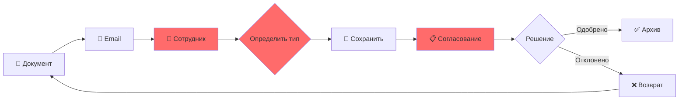
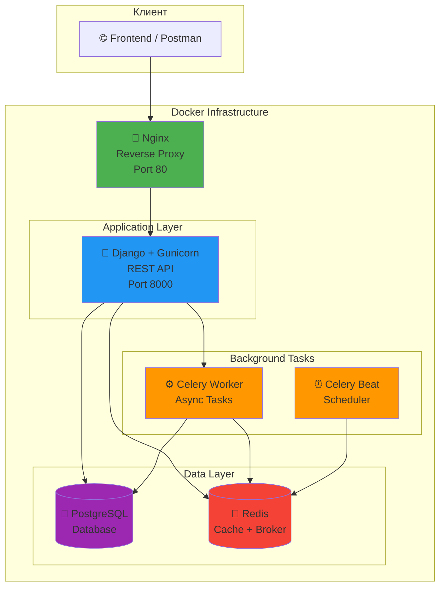
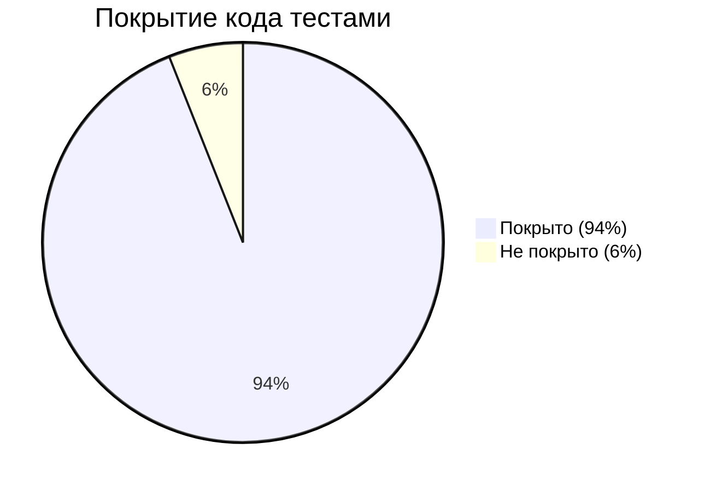
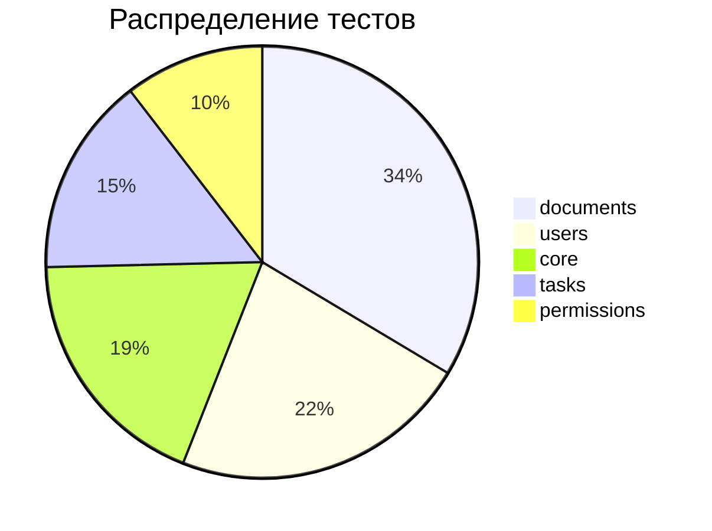

# Контент презентации для защиты дипломного проекта

**Проект:** OB3 Document Processing Service  
**Автор:** [Ваше имя]  
**Дата защиты:** [Дата]

---

## Слайд 1: Титульный

### Заголовок
**OB3 Document Processing Service**

### Подзаголовок
Сервис автоматизированной обработки документов

### Информация
- Имя Фамилия
- Backend Development
- Декабрь 2025
- @telegram_tag

---

## Слайд 2: Описание проблемы

### Заголовок
**Описание проблемы**

### Подзаголовок
Почему ручная обработка документов неэффективна

### Текст
Организации ежедневно обрабатывают сотни документов различных форматов: PDF, DOCX, изображения. Текущий процесс характеризуется:

- **Ручная классификация** — сотрудник определяет тип документа вручную
- **Отсутствие валидации** — ошибки обнаруживаются на поздних этапах
- **Нет единого хранилища** — документы разбросаны по папкам и почте
- **Долгий цикл обработки** — от получения до утверждения проходят часы/дни
- **Отсутствие уведомлений** — статус документа приходится проверять вручную

### Диаграмма (место для вставки)
```
[Пользователь] → [Email/Папка] → [Ручная сортировка] → [Согласование] → [Архив]
                      ↓
              15-30 минут на документ
```

---

## Слайд 3: Визуализация проблемы (опционально)

### Mermaid-диаграмма текущего процесса



**Проблемные точки (красным):**
- Ручное определение типа
- Отсутствие автоматизации
- Долгий цикл согласования

---

## Слайд 4: Концепция решения

### Заголовок
**Концепция решения**

### Подзаголовок
Автоматизация через REST API и асинхронную обработку

### Текст

**Подход к решению:**
- REST API для загрузки и управления документами
- Асинхронная обработка через очередь задач
- Автоматическая классификация по типу файла
- Email-уведомления при изменении статуса
- Разделение прав: пользователи и модераторы

**Основные тезисы из ТЗ:**
- Поддержка форматов: PDF, DOCX, TXT, изображения
- JWT-аутентификация
- Service Layer Pattern
- Docker-инфраструктура
- Минимум 75% покрытия тестами

---

## Слайд 5: Техническое описание

### Заголовок
**Техническое описание**

### Подзаголовок
Стек технологий и архитектурные решения

### Стек технологий

| Категория | Технология | Версия |
|-----------|------------|--------|
| Backend | Django + DRF | 5.2 / 3.16 |
| База данных | PostgreSQL | 16 |
| Кэш/Брокер | Redis | 7 |
| Асинхронность | Celery + Beat | 5.5 |
| Контейнеризация | Docker Compose | - |
| Reverse Proxy | Nginx | - |
| Документация | drf-spectacular | Swagger/ReDoc |

### Архитектурные решения

- **Service Layer Pattern** — бизнес-логика отделена от views
- **Abstract Base Classes** — UUIDModel, TimeStampedModel, SoftDeleteModel
- **Permission Classes** — IsOwner, IsModerator, IsModeratorOrOwner
- **Structured Logging** — Structlog (консоль dev, JSON prod)

---

## Слайд 6: Архитектурная диаграмма

### Mermaid-диаграмма архитектуры



**6 Docker-контейнеров:**
1. **postgres** — база данных
2. **redis** — кэш + брокер Celery
3. **web** — Django + Gunicorn
4. **celery_worker** — обработка задач
5. **celery_beat** — периодические задачи
6. **nginx** — reverse proxy

### Mermaid-диаграмма CI/CD Pipeline

```mermaid
flowchart LR
    subgraph "Development"
        A[💻 Локальная разработка] --> B[📝 Git Commit]
    end
    
    subgraph "Quality Gates"
        B --> C[🔍 Pre-commit Hooks]
        C --> D[Ruff + Black]
        D --> E[Mypy + Pyright]
        E --> F[✅ Commit Passed]
    end
    
    subgraph "Testing"
        F --> G[🧪 pytest-django]
        G --> H[134 теста]
        H --> I[📊 Coverage 94%]
    end
    
    subgraph "Deployment"
        I --> J[🐳 Docker Build]
        J --> K[docker compose up]
        K --> L[🚀 Staging Ready]
    end
    
    style C fill:#FF9800
    style G fill:#4CAF50
    style J fill:#2196F3
    style L fill:#9C27B0
```



---

## Слайд 7: Демонстрация решения

### Заголовок
**Демонстрация решения**

### Подзаголовок
Основные функциональности

### Скриншоты для вставки

1. **Django Admin** — список документов с цветными статусами
2. **Swagger UI** — интерактивная документация API
3. **Терминал** — запуск тестов с coverage

### Функциональности

| Функция | Описание |
|---------|----------|
| Загрузка документа | POST /api/v1/documents/ с файлом |
| Просмотр списка | GET с фильтрацией, поиском, сортировкой |
| Модерация | Approve/Reject через Admin или API |
| Уведомления | Email при загрузке и изменении статуса |
| Периодические задачи | Очистка старых документов, отчёты |

---

## Слайд 8: Мокап MacBook (для Figma)

### Инструкция
Вставить скриншот Swagger UI или Django Admin в мокап ноутбука.

### Рекомендуемый скриншот
- Swagger UI с развёрнутым эндпоинтом POST /api/v1/documents/
- Или Django Admin со списком документов

---

## Слайд 9: Результаты тестирования

### Заголовок
**Результаты тестирования**

### Подзаголовок
Качество кода и покрытие тестами

### Метрики

| Метрика | Значение | Цель |
|---------|----------|------|
| Всего тестов | 134 | - |
| Покрытие кода | 94% | ≥75% ✅ |
| Ошибок Ruff | 0 | 0 ✅ |
| Ошибок Mypy | 0 | 0 ✅ |
| Ошибок Pyright | 0 | 0 ✅ |

### Типы тестов

- **Unit-тесты** — сервисы, модели, permissions
- **Integration-тесты** — API endpoints, Celery tasks
- **Factory Boy + Faker** — генерация тестовых данных

### Инструменты

```bash
# Запуск тестов
docker compose exec web pytest

# Coverage отчёт
docker compose exec web pytest --cov --cov-report=html
```

---

## Слайд 10: Графики тестов (опционально)

### Mermaid-диаграмма покрытия



### Распределение тестов по модулям



### Скриншот для вставки
HTML-отчёт pytest-cov из `var/coverage/htmlcov/index.html`

---

## Слайд 11: Бизнес-ценность

### Заголовок
**Бизнес-ценность**

### Подзаголовок
Измеримые результаты внедрения

### Экономия времени

| Операция | До | После | Ускорение |
|----------|-----|-------|-----------|
| Загрузка документа | 5 мин | 10 сек | 30x |
| Классификация | 10 мин | автоматически | ∞ |
| Уведомление | ручное | автоматически | ∞ |
| Поиск документа | 15 мин | 2 сек | 450x |

### Ключевые преимущества

- **Снижение затрат:** автоматизация рутинных операций
- **Масштабируемость:** до 1000 документов/час с Celery workers
- **Надёжность:** 94% покрытие тестами, 0 ошибок линтера
- **Безопасность:** JWT-аутентификация, разделение прав
- **Прозрачность:** email-уведомления на каждом этапе

### Формула ROI
```
ROI = (Экономия времени × Стоимость часа × Кол-во документов) / Стоимость разработки
```

---

## Слайд 12: Заключение

### Заголовок
**Заключение**

### Подзаголовок
Итоги и планы развития

### Выполненная работа

- ✅ REST API для управления документами
- ✅ JWT-аутентификация с ролями
- ✅ Асинхронная обработка (Celery)
- ✅ Docker-инфраструктура (6 контейнеров)
- ✅ 134 теста, 94% coverage
- ✅ Полная документация (Swagger, README, BPA)

### Планы на будущее

- 🔮 OCR для извлечения текста из изображений
- 🔮 Полнотекстовый поиск (Elasticsearch)
- 🔮 ML-классификация документов
- 🔮 Frontend на React
- 🔮 Kubernetes для продакшена

### Контакты

- GitHub: github.com/username/ob3
- Telegram: @telegram_tag
- Email: email@example.com

---

## Скрипт выступления (10-12 минут)

### Вступление (30 сек)
"Добрый день! Меня зовут [Имя], и сегодня я представлю свой дипломный проект — OB3 Document Processing Service."

### Проблема (1.5 мин)
"Организации ежедневно обрабатывают сотни документов. Ручная обработка занимает 15-30 минут на документ: определение типа, валидация, согласование. Это дорого и подвержено ошибкам."

### Решение (1 мин)
"Я разработал backend-сервис, который автоматизирует этот процесс: загрузка через API, асинхронная обработка, автоматические уведомления."

### Техническая часть (2 мин)
"Стек: Django 5.2, PostgreSQL, Redis, Celery. Архитектура: 6 Docker-контейнеров. Использован Service Layer Pattern для чистоты кода."

### Демонстрация (2 мин)
[Показать Swagger UI или Django Admin]
"Вот как выглядит загрузка документа... модерация... уведомления..."

### Тестирование (1.5 мин)
"134 теста, 94% покрытие. Использовал pytest-django, Factory Boy. Все линтеры без ошибок."

### Бизнес-ценность (1.5 мин)
"Время обработки сократилось с 15 минут до 30 секунд — ускорение в 30 раз. Система масштабируется до 1000 документов в час."

### Заключение (1 мин)
"В итоге: работающий backend с полной документацией, готовый к продакшену. Планирую добавить OCR и ML-классификацию. Спасибо, готов ответить на вопросы!"

---

## Ответы на типичные вопросы

### Почему Django, а не FastAPI?
"Django — зрелый фреймворк с ORM, Admin, миграциями из коробки. Для CRUD-операций без тяжёлых I/O-bound задач синхронный Django + Celery — оптимальный выбор."

### Почему не async Django?
"Async Django оправдан при concurrent external API calls или WebSockets. В нашем случае тяжёлые операции выносятся в Celery, а views остаются простыми и синхронными."

### Как масштабировать?
"Горизонтально: добавить Celery workers. Вертикально: увеличить ресурсы контейнеров. В продакшене — Kubernetes с автоскейлингом."

### Почему Service Layer Pattern?
"Разделение ответственности: views отвечают за HTTP, сервисы — за бизнес-логику. Упрощает тестирование и поддержку."

### Как обеспечена безопасность?
"JWT-токены с истечением, permissions на уровне объектов (IsOwner), throttling, CORS-настройки, секреты в переменных окружения."
